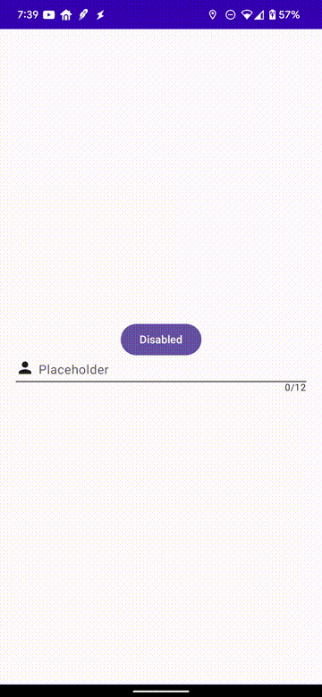
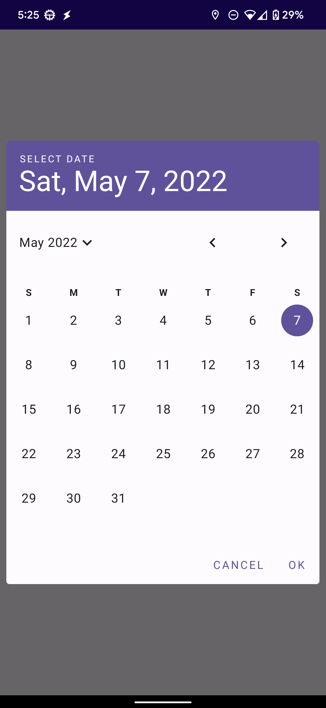
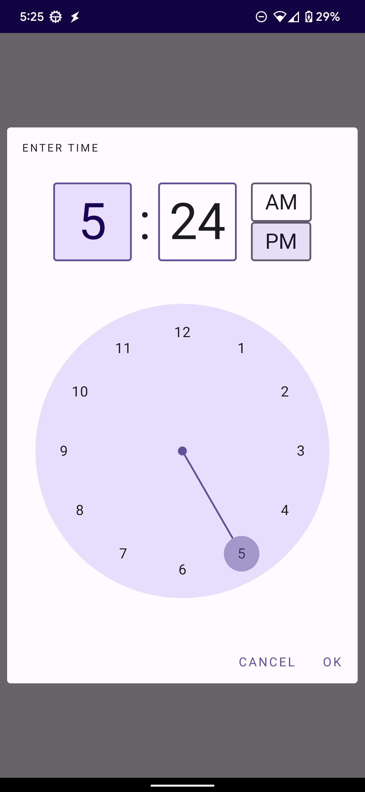

# Compose Components
[](https://GitHub.com/bohregard/Shared-Library/releases/)
[](https://GitHub.com/bohregard/Shared-Library/tags/)

Root `build.gradle.kts` repository configuration. *Note*: You'll need to create a github token to access GitHub Packages.

```kotlin
maven {
    name = "GitHubPackages"
    url = uri("https://maven.pkg.github.com/bohregard/Shared-Library")
    credentials {
        username = githubUser
        password = githubToken
    }
}
```

## Animated Text Field

An animated text field that is configurable the same way a TextField is configured.



### Example code:

```groovy
implementation 'com.bohregard:animated-textfield:<latest-version>'
```

```kotlin
var text by remember { mutableStateOf("") }
AnimatedTextField(
    enabled = enabled,
    leadingIcon = R.drawable.ic_person,
    maxCharacters = 12,
    onClear = { text = "" },
    onValueChange = { text = it },
    placeholder = "Placeholder",
    text = text
)
```

## Date Time Picker

A set of date/time pickers. They can be used separately or the combined `DateTimePicker` can be used if both are needed.
Returns a `LocalDateTime` object which can be converted to `Instant` if a UTC time is needed.




### Example code:

```groovy
implementation 'com.bohregard:datetime-picker:<latest-version>'
```

```kotlin
var showDateTimeDialog by remember { mutableStateOf(false) }
var showDateDialog by remember { mutableStateOf(false) }
var showTimeDialog by remember { mutableStateOf(false) }
var enabled by remember { mutableStateOf(true) }

DateTimePicker(
    date = LocalDateTime.now(),
    onDateSelected = {
        showDateTimeDialog = false
    },
    onDialogDismissed = {
        showDateTimeDialog = false
    },
    showDialog = showDateTimeDialog
)

DatePicker(
    date = LocalDate.now(),
    onDateSelected = {
        showDateDialog = false
    },
    onDialogDismissed = {
        showDateDialog = false
    },
    showDialog = showDateDialog
)

TimePicker(
    time = LocalTime.now(),
    onTimeSelected = {
        showTimeDialog = false
    },
    onDialogDismissed = {
        showTimeDialog = false
    },
    showDialog = showTimeDialog
)
```

## ExoPlayer Composable


A wrapper around ExoPlayer's UI view. Use either the `ExoPlayerDashComposable` or the `ExoPlayerMp4Composable`. Both return the `ExoPlayer` object for use as needed. If you need more control over the `ExoPlayer` object, you can use the `BaseExoPlayerComposable` and pass in your own player.

When the composable is disposed, the player is released. However if you use the `BaseExoPlayerComposable` you are responsible for releasing the player.

An XML layout can be used as needed. Follow the [instructions](https://exoplayer.dev/ui-components.html) on the official documentation. A composable can also be used if the `controls` field is passed in. This uses a `BoxScope` and is overlayed on the component. See the example below for more details on `controls`.

### Zoom/Pan

Zooming and Panning is supported if it's needed. To enabled, set `zoomable = true` on the `ExoPlayerConfig` object. The minimum zoom is 1f and the maximum zoom is 6f. The panning is bounded and clipped by the box it's contained in.

**Note**: If you have controls defined (via compose or XML), they will take precedent over the drag/pan gestures. However the controls can be placed below the ExoPlayer view as necessary.

### Example code:

```groovy
implementation 'com.bohregard:exoplayercomposable:<latest-version>'
```

```kotlin
@Composable
fun ExoplayerUi(dataStoreCache: DataStoreCache) {
    CompositionLocalProvider(
        LocalDataStoreCache provides dataStoreCache
    ) {
        ExoPlayerDashComposable(
            config = ExoPlayerConfig.DEFAULT,
            modifier = Modifier
                .aspectRatio(16 / 9f)
                .fillMaxWidth(),
            dashUrl = "http://ftp.itec.aau.at/datasets/DASHDataset2014/BigBuckBunny/2sec/BigBuckBunny_2s_onDemand_2014_05_09.mpd",
            onError = {
                Text("Error Playing Video")
            },
            controls = { player, hasVolume, timeline, duration, isPlaying ->
                Column(
                    modifier = Modifier
                        .fillMaxSize()
                        .clickable {
                            if (player.isPlaying) {
                                player.pause()
                            } else {
                                player.play()
                            }
                        },
                    verticalArrangement = Arrangement.Center,
                    horizontalAlignment = Alignment.CenterHorizontally
                ) {
                    AnimatedVisibility(
                        visible = !isPlaying,
                        enter = fadeIn(),
                        exit = fadeOut()
                    ) {
                        Image(
                            modifier = Modifier.size(32.dp),
                            painter = painterResource(id = R.drawable.ic_play),
                            contentDescription = "Play"
                        )
                    }
                }
            }
        )
    }
}
```

## Zoomable

A modifier to enable zooming, panning, and rotation on an item. It has a default zoom min of 1f and a max of 6f.

- [ ] Allow zoom min/max configuration
- [ ] Allow Boundary enable/disable (currently enabled by default)

### Example Code

```kotlin
@Composable
fun ZoomModifier() {
    Box(
        contentAlignment = Alignment.Center,
        modifier = Modifier
            .fillMaxWidth()
            .height(400.dp)
            .background(color = Color.Red)
    ) {
        Box(
            contentAlignment = Alignment.Center,
            modifier = Modifier
                .zoomable(enableRotation = true)
                .size(200.dp)
                .background(color = Color.Blue)
        ) {
            Text("Testing")
        }
    }
}
```
